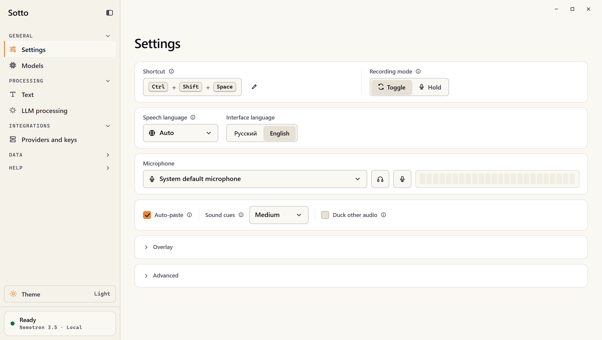
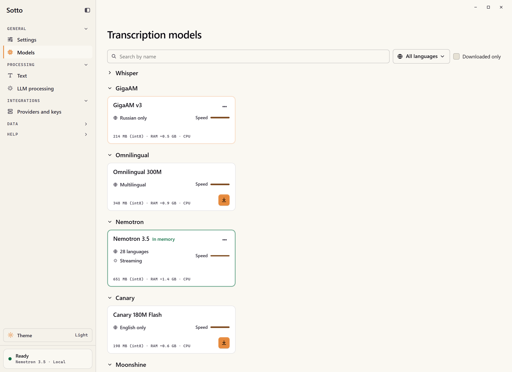
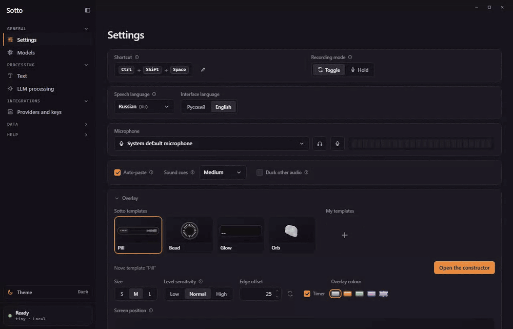
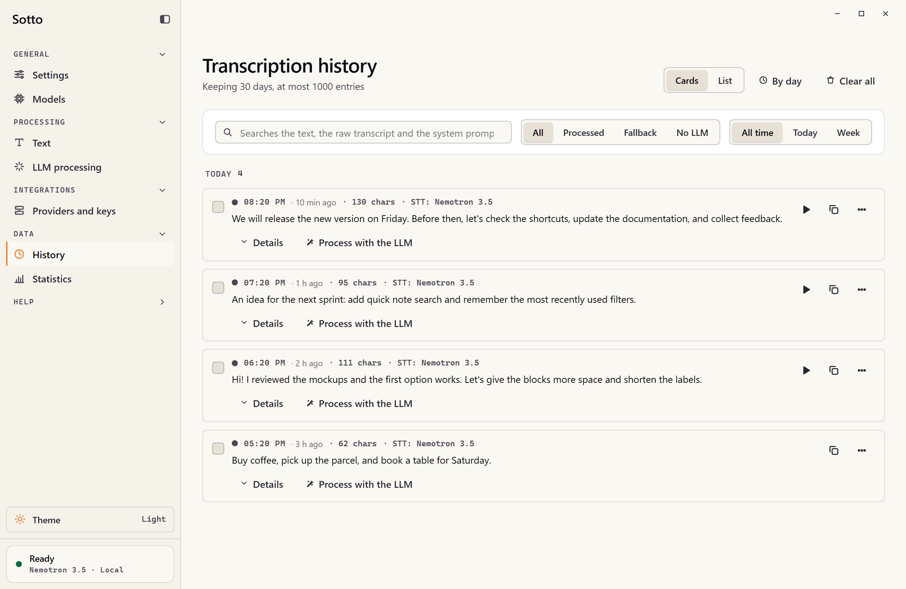

# Sotto

**Write with your voice.**

Sotto turns speech into text and inserts it into your active app. Dictate messages, notes, and prompts with local speech recognition — no account or subscription required.

**[Download Sotto](https://github.com/stofll/Sotto/releases/latest)** · [Features](#features) · [Overlay constructor](#build-your-own-overlay) · [Get started](#get-started) · [Documentation](docs/README.md)

English · [Русский](README.ru.md)

## Download

[Latest version — downloads and release notes](https://github.com/stofll/Sotto/releases/latest). Choose the asset for your system; `X.Y.Z` is the release version.

| System | Release asset |
| --- | --- |
| **Windows x64 · installer** | `Sotto_X.Y.Z_x64-setup-ui.exe` |
| **Windows x64 · portable** | `Sotto-vX.Y.Z-windows-x64-portable.zip` — [portable instructions](docs/portable.md) |
| **macOS · Apple Silicon** | `Sotto_X.Y.Z_aarch64.dmg` |

<picture>
  <source media="(prefers-color-scheme: dark)" srcset="docs/images/settings-en-dark.png" />
  
</picture>

*Interface previews use demonstration data.*

## Features

### Dictate where you work

Start and stop recording with a hotkey, or hold it for push-to-talk. Send the result straight to the active text field or copy it to the clipboard. Use voice for a quick reply, a longer note, or a detailed prompt.

### Transcribe offline

Download a model once and recognize speech on your computer, even without an internet connection. Local dictation is free, with no per-minute limits.

The catalog includes Whisper, GigaAM, Omnilingual, Nemotron, Canary, Moonshine, SenseVoice, Zipformer, and Parakeet. Search by name, filter by language or downloaded models, and compare languages, download size, estimated memory, and speed indicators before choosing.

See the [model guide](docs/models.md) for languages and download sizes.

<picture>
  <source media="(prefers-color-scheme: dark)" srcset="docs/images/models-en-dark.png" />
  
</picture>

### See words as you speak

Streaming models show a live draft in the overlay when its layout includes text. Follow recognition without opening the main window, see recording and processing status, and cancel a session from the overlay.

### Build your own overlay

Open **Settings → Overlay** to pick a ready-made template or **Open the constructor** to assemble your own. Start with a pill, bead, card, stack, island, captions, or mini shell; add a voice level, timer, recording indicator, language/model label, and streaming draft wherever the shell has room.

- **Compose visually:** click or drag parts into the preview, move them between regions, and choose drawings such as bars, pixels, an oscilloscope, a dot matrix, or an orb.
- **Style it:** adjust color, size, corners, stroke, fill, voice glow, font, and motion. Set screen position and edge offset in Overlay settings.
- **Preview each state:** try recording, streaming, processing, insertion, errors, and the recording-limit countdown with a simulated voice. Customize the processing animation and insertion confirmation too.
- **Keep your favorites:** changes apply automatically; save up to eight named templates to switch between later. Each keeps its composition, color, and size without changing screen position.

*Recorded in Sotto's actual constructor with synthetic app state and its built-in simulated voice; no microphone or speech recognition is running.*

The constructor preview and recording window render the same overlay components. Your composition is saved locally, and changes also apply to an open overlay. The cancel control remains available in every design. See [Overlay appearance](docs/overlay.md) for the full guide.

### Clean up text locally

Remove filler sounds, verbal tics, repeated words, recognition artifacts, and extra spaces; adjust capitalization and final punctuation. Enable conservative Russian spelling correction or paragraph grouping when useful. Each cleanup step can be switched off, and the live before/after preview lets you try the result without dictating.

Enable built-in term dictionaries or create your own sets for names, brands, and specialist vocabulary. Add explicit replacement rules for words, phrases, substrings, or regular expressions, with case controls and JSON import/export. See [Dictionaries and cleanup](docs/dictionaries.md) for matching behavior and limits.

### Add AI processing when you need it

Connect an optional LLM for punctuation and formatting, and save your instructions as reusable profiles. The LLM tidies what you said rather than rewriting it: an answer that drops a negation, a number or a name, or loses a large part of the text, is replaced by the local result. Long texts are processed in parts, and each profile chooses how much a reasoning model may think. Use OpenAI, Anthropic, Gemini, or an OpenAI-compatible service, including local Ollama and LM Studio. Apply a profile to dictation, process pasted text manually, or reprocess a history entry and review the changes before accepting them.

Cloud speech recognition is also available through configured provider profiles. Local recognition and cleanup work without these integrations; external providers may charge for usage.

### Transcribe recordings

Open **LLM processing → Process the text**, then choose or drop an audio file. For local file transcription, select a Whisper, GigaAM, Parakeet Ultra or Qwen3 model; the other Sherpa-ONNX models support dictation but do not transcribe files. A configured cloud speech provider can also transcribe files when cloud recognition is selected.

File transcription stays in that panel, separate from dictation history and automatic pasting. It does not require an LLM connection.

### Revisit what you said

Search and filter dictation history stored on your computer, copy an earlier result, inspect its original text, or delete individual entries or a selection. Configure retention by age and entry count.

Enable **Settings → Advanced → Save audio recordings** to listen to future dictations from history. Audio saving is off by default and has its own retention limit; the play button appears only for entries with a saved recording.

Statistics show usage over selected periods and estimate typing time saved using your configured typing speed.

<picture>
  <source media="(prefers-color-scheme: dark)" srcset="docs/images/history-en-dark.png" />
  
</picture>

### Fit dictation into your day

Choose and test your microphone, configure the hotkey and recording mode, and use sound cues or optional audio ducking during recording. A configurable recording limit stops and transcribes a forgotten session; idle model unloading frees memory between sessions. The interface supports Russian and English, light and dark themes, and a custom accent color independent of the overlay.

## Get started

### 1. Download and install

Get the latest version from [Releases](https://github.com/stofll/Sotto/releases/latest).

| Platform | Installation |
| --- | --- |
| **Windows x64** | Run the `.exe` installer, or unpack the [portable ZIP](docs/portable.md) and launch `Sotto.exe`. |
| **macOS · Apple Silicon** | Open the `.dmg` and drag Sotto into Applications. Grant microphone and Accessibility permissions when prompted. |

Windows and macOS are supported platforms. Linux is an experimental build target; full functionality is not guaranteed. See [platform support](docs/platforms.md) for architecture details and limitations.

Builds currently lack a publisher certificate, so Windows or macOS may warn on first launch.

See [verifying a download](docs/verifying-downloads.md) for file checks and first-launch instructions, or [troubleshooting](docs/troubleshooting.md) if installation fails.

Installed builds support automatic updates with signature verification; portable copies are updated manually.

### 2. Choose a model

The first-launch introduction helps you download a local model, configure the hotkey, and choose a microphone. You can skip it and reopen it later from **Help → Repeat introduction**.

To change models later, open **Models**, download a model for your language, and select it for dictation. For example, GigaAM v3 recognizes Russian, while Whisper and Parakeet TDT v3 offer multilingual options; Nemotron 3.5 supports a multilingual streaming draft.

### 3. Dictate your first phrase

Place the cursor in a text field and use your configured hotkey:

- **Toggle mode:** press to start, speak, then press again to finish.
- **Push-to-talk:** hold while speaking and release to finish.

## Privacy

Local recognition is the default. Audio is sent to a cloud speech provider only when you configure and use one; cloud LLM processing sends text to your chosen provider.

Product telemetry is off until you allow it: the introduction offers it, and **Settings → Advanced** can change it later. It contains no audio, transcripts, or dictated text. See [Privacy](docs/privacy.md) and [Telemetry](docs/telemetry.md) for details.

## Documentation and contributing

- [Documentation](docs/README.md) — models, platforms, privacy, and troubleshooting.
- [Development](docs/development.md) — prerequisites and building from source.
- [Contributing](CONTRIBUTING.md) and [Testing](docs/testing.md) — contributing changes and required checks.
- [Support](SUPPORT.md) — questions and bug reports; [Security](SECURITY.md) — private vulnerability reporting.

## License

Sotto is free and open source under the [MIT License](LICENSE).

Third-party components and speech models have their own license terms; dependency and license inventories are attached to releases. Provider names and logos belong to their respective owners and do not imply affiliation or endorsement.
