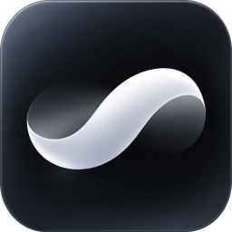
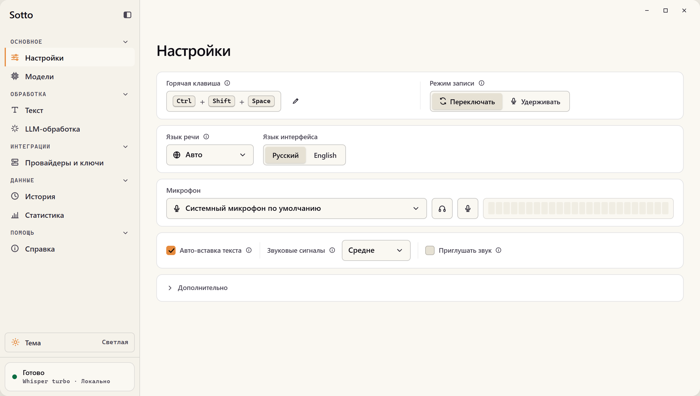
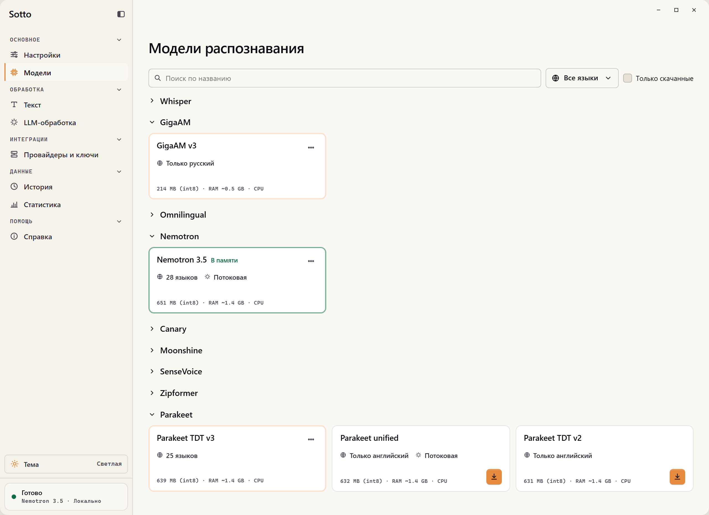
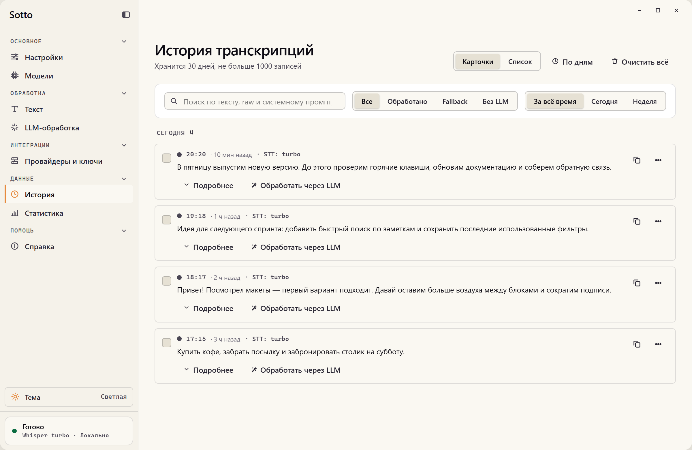

# Sotto

**Пишите голосом.**

Sotto превращает речь в текст и вставляет его в активное приложение. Диктуйте сообщения, заметки и промпты — распознавание работает локально, без аккаунта и подписки.

**[Скачать Sotto](https://github.com/stofll/Sotto/releases/latest)** · [Возможности](#возможности) · [Начало работы](#начало-работы) · [Документация](docs/README.md)

[English](README.md) · Русский

## Скачать

[Последняя версия — файлы и список изменений](https://github.com/stofll/Sotto/releases/latest). Выберите файл для своей системы; `X.Y.Z` — номер версии релиза.

| Система | Файл в релизе |
| --- | --- |
| **Windows x64 · установщик** | `Sotto_X.Y.Z_x64-setup.exe` |
| **Windows x64 · portable** | `Sotto-vX.Y.Z-windows-x64-portable.zip` — [инструкция](docs/portable.md) |
| **macOS · Apple Silicon** | `Sotto_X.Y.Z_aarch64.dmg` |

<picture>
  <source media="(prefers-color-scheme: dark)" srcset="docs/images/settings-ru-dark.png" />
  
</picture>

*На скриншотах используются демонстрационные данные.*

## Возможности

### Диктуйте прямо в приложении

Запускайте и останавливайте запись горячей клавишей или удерживайте её во время речи. Готовый текст вставляется в активное поле или копируется в буфер обмена. Короткий ответ, длинная заметка или подробный промпт — всё можно надиктовать.

### Распознавайте речь без интернета

Скачайте модель один раз и распознавайте речь на компьютере даже без подключения к сети. Выбирайте Whisper, GigaAM, Parakeet и другие модели под свой язык и компьютер. Локальная диктовка бесплатна, без ограничений по минутам.

Языки и размеры загрузок — в [руководстве по моделям](docs/models.md).

<picture>
  <source media="(prefers-color-scheme: dark)" srcset="docs/images/models-ru-dark.png" />
  
</picture>

### Следите за текстом во время речи

Потоковые модели показывают промежуточный текст в компактном оверлее. Следите за распознаванием, не открывая главное окно: оверлей также показывает состояние записи и обработки.

### Настройте обработку текста

Добавьте замены для имён, терминов и повторяющихся ошибок распознавания.

Для пунктуации и форматирования подключите LLM и сохраните свои инструкции в профилях. Поддерживаются OpenAI, Anthropic, Gemini и OpenAI-совместимые сервисы, включая локальные Ollama и LM Studio.

При желании можно подключить и облачное распознавание речи. Внешние провайдеры могут брать плату за использование.

### Расшифровывайте записи

Прикрепите аудиофайл в панели **«Обработать текст»** и получите расшифровку там же. Она остаётся в панели, отдельно от истории диктовки и автоматической вставки текста.

### Возвращайтесь к сказанному

История диктовки хранится на вашем компьютере. Повторно обработайте запись сохранённым LLM-профилем и сравните изменения перед сохранением. Статистика поможет оценить, сколько времени вы сэкономили на наборе текста.

<picture>
  <source media="(prefers-color-scheme: dark)" srcset="docs/images/history-ru-dark.png" />
  
</picture>

Звуковые сигналы, приглушение других приложений на время записи и автоматическая выгрузка модели из памяти при простое делают повседневную диктовку удобнее.

## Начало работы

### 1. Скачайте и установите

Последняя версия доступна на странице [Releases](https://github.com/stofll/Sotto/releases/latest).

| Платформа | Установка |
| --- | --- |
| **Windows x64** | Запустите установщик `.exe` или распакуйте [портативный ZIP](docs/portable.md) и откройте `Sotto.exe`. |
| **macOS · Apple Silicon** | Откройте `.dmg` и перетащите Sotto в «Программы». Разрешите доступ к микрофону и функции «Универсальный доступ» по запросу. |

Windows и macOS — поддерживаемые платформы. Linux доступен как экспериментальная цель сборки, без гарантии полной работоспособности. Подробности об архитектурах и ограничениях — в [описании поддержки платформ](docs/platforms.md).

Сборки пока не подписаны сертификатом издателя, поэтому Windows или macOS могут показать предупреждение при первом запуске.

Инструкции по проверке файла и запуску есть в [руководстве по проверке загрузок](docs/verifying-downloads.md), помощь с установкой — в [устранении неполадок](docs/troubleshooting.md).

Установленная версия поддерживает автообновления с проверкой подписи; портативная обновляется вручную.

### 2. Выберите модель

Откройте **«Модели»**, скачайте модель для своего языка и выберите её для диктовки. В каталоге указаны языки и размер каждой модели. Например, GigaAM v3 распознаёт русскую речь, а Whisper и Parakeet TDT v3 предлагают многоязычные варианты.

### 3. Продиктуйте первую фразу

Поставьте курсор в текстовое поле и используйте настроенную горячую клавишу:

- **Режим переключения:** нажмите, произнесите фразу и нажмите ещё раз, чтобы закончить запись.
- **Режим удержания:** говорите, пока клавиша нажата, и отпустите её для завершения.

## Приватность

По умолчанию распознавание работает локально. Аудио отправляется облачному провайдеру распознавания только при его настройке и использовании; облачная LLM-обработка передаёт текст выбранному провайдеру.

Продуктовая телеметрия включена по умолчанию и отключается в **«Настройки → Дополнительно»**. Она не содержит аудио, расшифровок или продиктованного текста. Подробнее — в документах о [приватности](docs/privacy.md) и [телеметрии](docs/telemetry.md).

## Документация и участие

- [Документация](docs/README.md) — модели, платформы, приватность и устранение неполадок.
- [Разработка](docs/development.md) — подготовка окружения и сборка из исходников.
- [Участие в проекте](CONTRIBUTING.md) и [тестирование](docs/testing.md) — правила внесения изменений и обязательные проверки.
- [Поддержка](SUPPORT.md) — вопросы и сообщения об ошибках; [безопасность](SECURITY.md) — конфиденциальные сообщения об уязвимостях.

## Лицензия

Sotto — бесплатное приложение с открытым исходным кодом под лицензией [MIT](LICENSE).

У сторонних компонентов и моделей распознавания свои условия лицензирования; списки зависимостей и лицензий приложены к релизам. Названия и логотипы провайдеров принадлежат их владельцам и не подразумевают партнёрства или одобрения проекта.
