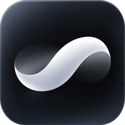
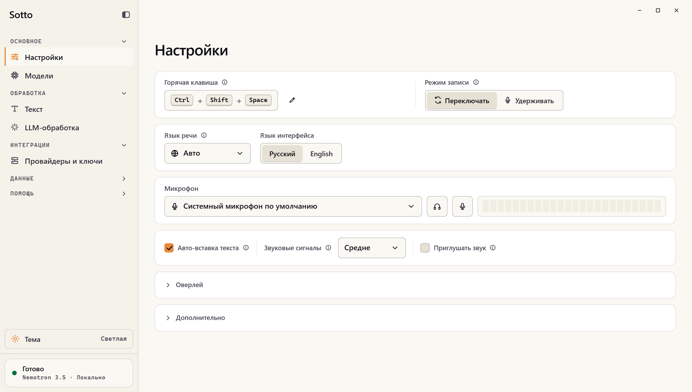
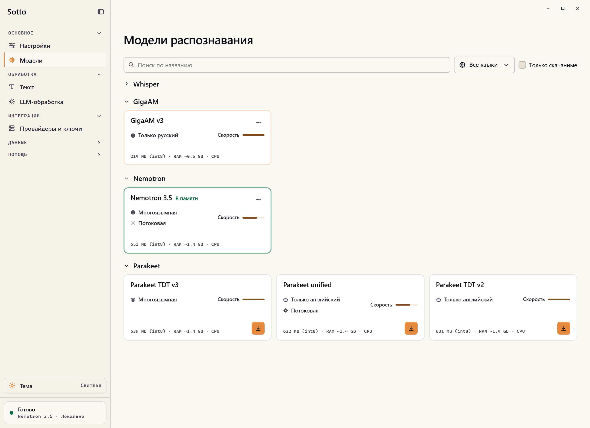
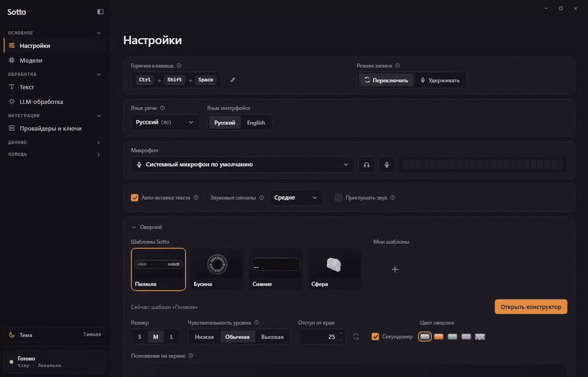
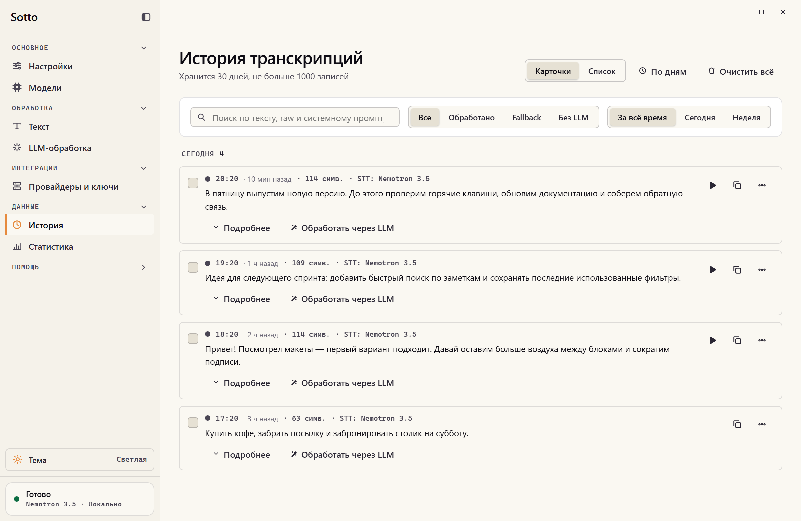

# Sotto

**Пишите голосом.**

Sotto превращает речь в текст и вставляет его в активное приложение. Диктуйте сообщения, заметки и промпты — распознавание работает локально, без аккаунта и подписки.

**[Скачать Sotto](https://github.com/stofll/Sotto/releases/latest)** · [Возможности](#возможности) · [Конструктор оверлея](#соберите-свой-оверлей) · [Начало работы](#начало-работы) · [Документация](docs/README.md)

[English](README.md) · Русский

## Скачать

[Последняя версия — файлы и список изменений](https://github.com/stofll/Sotto/releases/latest). Выберите файл для своей системы; `X.Y.Z` — номер версии релиза.

| Система | Файл в релизе |
| --- | --- |
| **Windows x64 · установщик** | `Sotto_X.Y.Z_x64-setup-ui.exe` |
| **Windows x64 · portable** | `Sotto-vX.Y.Z-windows-x64-portable.zip` — [инструкция](docs/portable.md) |
| **macOS · Apple Silicon** | `Sotto_X.Y.Z_aarch64.dmg` |

<picture>
  <source media="(prefers-color-scheme: dark)" srcset="docs/images/settings-ru-dark.png" />
  
</picture>

*На скриншотах используются демонстрационные данные.*

## Возможности

### Диктуйте прямо в приложении

Запускайте и останавливайте запись горячей клавишей или удерживайте её во время речи. Готовый текст вставляется в активное поле или копируется в буфер обмена. Короткий ответ, длинная заметка или подробный промпт — всё можно надиктовать.

### Распознавайте речь без интернета

Скачайте модель один раз и распознавайте речь на компьютере даже без подключения к сети. Локальная диктовка бесплатна, без ограничений по минутам.

В каталоге есть Whisper, GigaAM, Omnilingual, Nemotron, Canary, Moonshine, SenseVoice, Zipformer и Parakeet. Ищите по названию, фильтруйте по языку или наличию загрузки и сравнивайте языки, размер, примерное потребление памяти и показатели скорости перед выбором.

Языки и размеры загрузок — в [руководстве по моделям](docs/models.md).

<picture>
  <source media="(prefers-color-scheme: dark)" srcset="docs/images/models-ru-dark.png" />
  
</picture>

### Следите за текстом во время речи

Потоковые модели показывают промежуточный текст в оверлее, если его макет содержит область для текста. Следите за распознаванием без главного окна, проверяйте состояние записи и обработки и отменяйте сессию прямо из оверлея.

### Соберите свой оверлей

Откройте **«Настройки → Оверлей»**, чтобы выбрать готовый шаблон, или нажмите **«Открыть конструктор»**, чтобы собрать свой. Начните с корпуса: пилюля, бусина, карточка, стопка, остров, субтитры или мини. Добавьте уровень голоса, таймер, индикатор записи, язык и модель, потоковый черновик — в те области, где для них есть место.

- **Собирайте визуально:** добавляйте детали кликом или перетаскиванием, перемещайте между областями и выбирайте рисунок — столбики, пиксели, осциллограф, точечную матрицу, сферу и другие варианты.
- **Настраивайте стиль:** цвет, размер, скругление, обводку, заливку, свечение от голоса, шрифт и движение. Положение на экране и отступ от края задаются в настройках оверлея.
- **Проверяйте все состояния:** запись, стриминг, обработку, вставку, ошибку и отсчёт до лимита — на имитации голоса. Анимация обработки и подтверждение вставки тоже настраиваются.
- **Сохраняйте любимые варианты:** изменения применяются автоматически; до восьми именованных шаблонов позволяют быстро менять оформление. Каждый хранит состав, цвет и размер, сохраняя выбранное положение на экране.

*Запись настоящего конструктора Sotto с тестовыми данными и встроенной имитацией голоса. Микрофон и распознавание речи не используются.*

Предпросмотр конструктора и окно записи используют одни и те же компоненты оверлея. Собранный макет сохраняется локально; изменения применяются и к уже открытому оверлею. Кнопка отмены остаётся доступной в любом оформлении. Подробности — в [руководстве по оверлею](docs/overlay.md).

### Очищайте текст локально

Убирайте звуки-заполнители, слова-паразиты, повторы, артефакты распознавания и лишние пробелы; настраивайте заглавные буквы и знак в конце фразы. При необходимости включайте осторожное исправление русских опечаток или разбиение на абзацы. Каждый этап очистки можно отключить, а живой предпросмотр «до/после» позволяет проверить результат без диктовки.

Включайте встроенные словари или создавайте свои наборы имён, брендов и профессиональных терминов. Для точных исправлений добавляйте правила замены слов, фраз, подстрок или регулярных выражений — с настройкой регистра, импортом и экспортом JSON. Принципы сопоставления и ограничения описаны в [руководстве по словарям и очистке](docs/dictionaries.md).

### Подключайте AI-обработку по необходимости

Подключите LLM для пунктуации и форматирования и сохраните свои инструкции в профилях. LLM приводит в порядок сказанное, а не переписывает его: если в ответе пропало отрицание, число или название либо исчезла заметная часть текста, вставляется локальный результат. Длинный текст обрабатывается частями, а в профиле можно выбрать, сколько рассуждающей модели разрешено думать. Поддерживаются OpenAI, Anthropic, Gemini и OpenAI-совместимые сервисы, включая локальные Ollama и LM Studio. Применяйте профиль к диктовке, обрабатывайте вставленный текст вручную или повторно обработайте запись истории и сравните изменения перед сохранением.

Облачное распознавание речи тоже доступно через настроенные профили провайдеров. Локальные распознавание и очистка работают без этих подключений; внешние провайдеры могут брать плату за использование.

### Расшифровывайте записи

Откройте **«LLM-обработка → Обработать текст»**, затем выберите или перетащите аудиофайл. Локально файлы расшифровывает любая скачанная модель. Если выбрано облачное распознавание, файлы также можно расшифровать через настроенного провайдера.

Расшифровка остаётся в панели, отдельно от истории диктовки и автоматической вставки текста. Подключение LLM для неё не требуется.

### Возвращайтесь к сказанному

Ищите и фильтруйте диктовки в локальной истории, копируйте прошлые результаты, смотрите исходный текст и удаляйте записи по одной или группой. Задайте срок хранения и максимальное число записей.

Включите **«Настройки → Дополнительно → Сохранять аудиозаписи»**, чтобы прослушивать будущие диктовки из истории. Сохранение аудио по умолчанию выключено и имеет отдельный лимит хранения; кнопка воспроизведения появляется только у записей с сохранённым аудио.

Статистика показывает использование за выбранный период и оценивает сэкономленное время с учётом заданной вами скорости ручного набора.

<picture>
  <source media="(prefers-color-scheme: dark)" srcset="docs/images/history-ru-dark.png" />
  
</picture>

### Настройте повседневную диктовку

Выбирайте и проверяйте микрофон, настраивайте горячую клавишу и режим записи, включайте звуковые сигналы и приглушение других приложений. Настраиваемый лимит остановит и расшифрует забытую запись, а выгрузка модели при простое освободит память между сессиями. В интерфейсе есть русский и английский языки, светлая и тёмная темы и свой акцентный цвет, независимый от цвета оверлея.

## Начало работы

### 1. Скачайте и установите

Последняя версия доступна на странице [Releases](https://github.com/stofll/Sotto/releases/latest).

| Платформа | Установка |
| --- | --- |
| **Windows x64** | Запустите установщик `.exe` или распакуйте [портативный ZIP](docs/portable.md) и откройте `Sotto.exe`. |
| **macOS · Apple Silicon** | Откройте `.dmg` и перетащите Sotto в «Программы». Разрешите доступ к микрофону и функции «Универсальный доступ» по запросу. |

Windows и macOS — поддерживаемые платформы. Linux доступен как экспериментальная цель сборки, без гарантии полной работоспособности. Подробности об архитектурах и ограничениях — в [описании поддержки платформ](docs/platforms.md).

Сборки пока не подписаны сертификатом издателя, поэтому Windows или macOS могут показать предупреждение при первом запуске.

Инструкции по проверке файла и запуску есть в [руководстве по проверке загрузок](docs/verifying-downloads.md), помощь с установкой — в [устранении неполадок](docs/troubleshooting.md).

Установленная версия поддерживает автообновления с проверкой подписи; портативная обновляется вручную.

### 2. Выберите модель

Введение при первом запуске поможет скачать локальную модель, настроить горячую клавишу и выбрать микрофон. Его можно пропустить и позже открыть через **«Помощь → Пройти введение ещё раз»**.

Чтобы сменить модель позже, откройте **«Модели»**, скачайте модель для своего языка и выберите её для диктовки. Например, GigaAM v3 распознаёт русскую речь, Whisper и Parakeet TDT v3 предлагают многоязычные варианты, а Nemotron 3.5 поддерживает многоязычный потоковый черновик.

### 3. Продиктуйте первую фразу

Поставьте курсор в текстовое поле и используйте настроенную горячую клавишу:

- **Режим переключения:** нажмите, произнесите фразу и нажмите ещё раз, чтобы закончить запись.
- **Режим удержания:** говорите, пока клавиша нажата, и отпустите её для завершения.

## Приватность

По умолчанию распознавание работает локально. Аудио отправляется облачному провайдеру распознавания только при его настройке и использовании; облачная LLM-обработка передаёт текст выбранному провайдеру.

Продуктовая телеметрия выключена, пока вы её не разрешите: её предлагает введение, а изменить выбор можно в **«Настройки → Дополнительно»**. Она не содержит аудио, расшифровок или продиктованного текста. Подробнее — в документах о [приватности](docs/privacy.md) и [телеметрии](docs/telemetry.md).

## Документация и участие

- [Документация](docs/README.md) — модели, платформы, приватность и устранение неполадок.
- [Разработка](docs/development.md) — подготовка окружения и сборка из исходников.
- [Участие в проекте](CONTRIBUTING.md) и [тестирование](docs/testing.md) — правила внесения изменений и обязательные проверки.
- [Поддержка](SUPPORT.md) — вопросы и сообщения об ошибках; [безопасность](SECURITY.md) — конфиденциальные сообщения об уязвимостях.

## Лицензия

Sotto — бесплатное приложение с открытым исходным кодом под лицензией [MIT](LICENSE).

У сторонних компонентов и моделей распознавания свои условия лицензирования; списки зависимостей и лицензий приложены к релизам. Названия и логотипы провайдеров принадлежат их владельцам и не подразумевают партнёрства или одобрения проекта.
